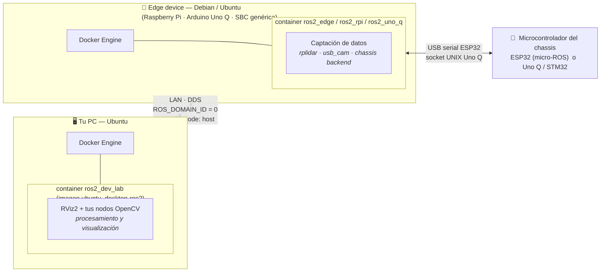
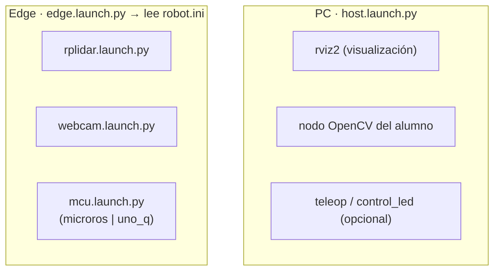
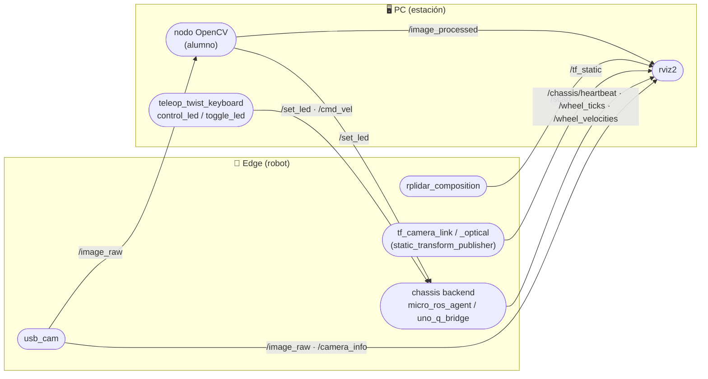
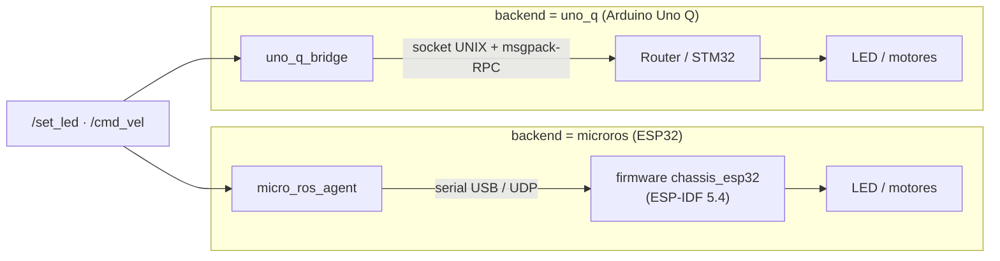
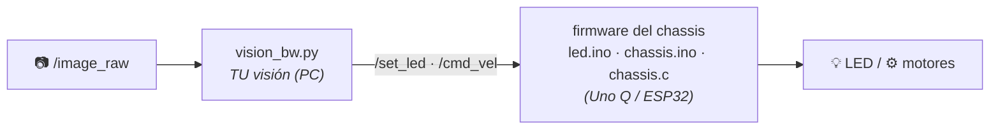

# ros2_jazzy_ws — plataforma educativa TurtleBot (ROS 2 Jazzy)

Entorno de desarrollo **dockerizado** para enseñar visión artificial y robótica
con ROS 2 Jazzy sobre un robot tipo TurtleBot (webcam + RPLidar + chassis con
microcontrolador).

La idea es simple: **el robot capta, tu PC procesa y visualiza.** Ambos hablan
el mismo ROS 2 por la red, así que un nodo que corre en tu PC ve los sensores
del robot como si estuvieran conectados localmente.

> ¿Vas a montar tu robot por primera vez? Empieza por
> [`docs/01-runbook-instalacion.md`](docs/01-runbook-instalacion.md). Este README
> explica **cómo encaja todo**; los runbooks explican **cómo hacerlo paso a paso**.

---

## 1. Cómo está distribuido el sistema

Hay dos roles de máquina, cada uno con su contenedor Docker. Los dos usan
`network_mode: host` y el **mismo `ROS_DOMAIN_ID=0`**, por eso el
descubrimiento DDS los conecta automáticamente en la misma LAN.



**Por qué así:** la SBC del robot tiene pocos recursos; se limita a **captar**
(cámara, rplidar) y a **puentear** el chassis. Todo lo pesado —OpenCV, RViz2,
teleoperación— corre en tu PC. En una Raspberry, correr RViz o compilar todo el
workspace puede agotar la RAM: en el edge usa siempre `robot edge` (nunca
`robot dev`).

### Contenedores y comandos

| Máquina | Contenedor | Imagen | Comando | Qué levanta |
|---|---|---|---|---|
| **PC** (estación) | `ros2_dev_lab` | `ubuntu_desktop-ros2` | `robot dev` | RViz2, tus nodos OpenCV, teleop |
| **Edge** genérico | `ros2_edge` | `ubuntu_edge-ros2` | `robot edge` | rplidar · usb_cam · chassis |
| **Raspberry Pi** | `ros2_rpi` | `ubuntu_rpi-ros2` | `robot rpi` | rplidar · usb_cam · chassis (micro-ROS) |
| **Arduino Uno Q** | `ros2_uno_q` | `ubuntu_uno_q-ros2` | `robot uno_q` | rplidar · usb_cam · chassis (uno_q_bridge) |
| **ESP32** (firmware) | `esp32_dev_lab` | `esp32-idf` | `robot esp` | ESP-IDF 5.4 para flashear el firmware |

> **Edge vs Raspberry vs Uno Q:** el edge/rpi traen el **micro-ROS agent**
> compilado (hablan con la ESP32 por serial). El Uno Q **no** trae agent: usa el
> paquete `uno_q_bridge` para hablar con su MCU por socket UNIX. Qué backend se
> usa lo decide una sola línea de `robot.ini` (ver abajo).

### Qué corre en cada lado



El edge **no lleva parámetros a mano**: `edge.launch.py` lee
[`ros2_ws/src/turtlebot_core/robot.ini`](ros2_ws/src/turtlebot_core/robot.ini)
y despliega **solo** los dispositivos que el alumno marcó como conectados.

```ini
[platform]
backend = microros        # microros (ESP32) | uno_q (Arduino Uno Q)

[devices]
rplidar = true            # levanta rplidar solo si es true
webcam  = true
chassis = true
```

---

## 2. Instalación y el comando `robot`

Con el repo clonado, un solo script deja todo listo: inicializa los submódulos
(firmware de la ESP32 y paquetes) e instala el comando `robot`.

```bash
./install.sh
source ~/.bashrc      # recarga tu shell para activar el comando robot
```

`install.sh` es **idempotente** (puedes correrlo varias veces sin duplicar nada)
y hace dos cosas:

1. `git submodule update --init --recursive` — baja los submódulos.
2. Agrega la función `robot` a tu `~/.bashrc`, solo si aún no está.

### El comando `robot`

`robot` es un lanzador **sensible al contexto**: desde la raíz del proyecto
levanta el contenedor Docker que le pidas. Al ser una función en tu `~/.bashrc`,
está disponible en cualquier terminal sin ensuciar el `PATH`.

```bash
robot dev     # PC:      contenedor de desarrollo (RViz2, OpenCV)
robot edge    # robot:   contenedor edge genérico
robot rpi     # robot:   contenedor Raspberry Pi
robot uno_q   # robot:   contenedor Arduino Uno Q
robot esp     # firmware: ESP-IDF 5.4 para la ESP32
robot rm      # limpieza: elimina el contenedor y libera espacio
```

Detalles en [`docs/robot-command.md`](docs/robot-command.md).

---

## 3. El canal DDS (cómo se conectan las máquinas)

ROS 2 no tiene un "master" central: los nodos se descubren solos por **DDS**
(Data Distribution Service), el middleware que transporta los topics por la red.
Con dos ajustes basta para que tu PC y el robot se vean:

- **`ROS_DOMAIN_ID`** — el "canal". Solo los nodos con el **mismo número**
  (0–232) se descubren entre sí. Aquí es **0** en todos los contenedores (fijado
  en cada `docker-compose.yml`). Cámbialo únicamente si compartes la LAN con otro
  equipo y quieres aislarte — pero usa el **mismo valor en todas tus máquinas**.
- **Misma red / `network_mode: host`** — los contenedores usan la red del
  anfitrión, así que basta con que **PC y robot estén en la misma LAN** (mismo
  router/switch), sin VPN ni NAT de por medio.

### Cómo configurarlo

Ya viene configurado. Para verificarlo o fijarlo dentro de un contenedor:

```bash
echo $ROS_DOMAIN_ID          # debe imprimir 0 en la PC y en el robot
export ROS_DOMAIN_ID=0       # solo si necesitas fijarlo en la sesión actual
```

Para cambiarlo de forma permanente, edita `environment: ROS_DOMAIN_ID` en el
`docker-compose.yml` correspondiente y vuelve a levantar el contenedor.

### Qué deberías ver

Con el robot lanzando `edge.launch.py`, abre una terminal en tu PC
(`robot dev`): los topics del robot deben aparecer **como si fueran locales**.

```bash
ros2 topic list
# /scan
# /image_raw
# /camera_info
# /tf_static
# /set_led ...

ros2 node list
# /rplidar_composition
# /usb_cam ...

ros2 topic hz /scan                    # frecuencia estable (~10 Hz) = enlace vivo
ros2 topic echo /image_raw --no-arr    # llegan mensajes = DDS OK
```

Si `ros2 topic list` en la PC muestra los topics del robot, el canal DDS
funciona. Si **no** aparecen, revisa los tres sospechosos: mismo
`ROS_DOMAIN_ID`, misma LAN, y que ningún firewall bloquee el tráfico UDP /
multicast de DDS.

---

## 4. Flujo de datos / Grafo ROS

Una vez que ambos contenedores están arriba, los nodos se descubren por DDS y
los topics viajan por la red en las dos direcciones:

- **Edge → PC:** los sensores (`/scan`, `/image_raw`, TF) y la telemetría del
  chassis.
- **PC → Edge:** las órdenes (`/set_led` desde tu visión artificial, `/cmd_vel`
  desde teleop).



### Topics del sistema

| Topic | Tipo | Origen (publica) | Destino (suscribe) | Sentido |
|---|---|---|---|---|
| `/scan` | `sensor_msgs/LaserScan` | `rplidar_composition` (edge) | rviz2, nav (PC) | edge → PC |
| `/image_raw` | `sensor_msgs/Image` | `usb_cam` (edge) | rviz2, nodo OpenCV (PC) | edge → PC |
| `/camera_info` | `sensor_msgs/CameraInfo` | `usb_cam` (edge) | rviz2 (PC) | edge → PC |
| `/tf_static` | `tf2_msgs/TFMessage` | `static_transform_publisher` (edge) | rviz2 (PC) | edge → PC |
| `/chassis/heartbeat` | `std_msgs/Int32` | ESP32 `chassis_esp32` (micro-ROS) | debug (PC) | edge → PC |
| `/wheel_ticks` | `std_msgs/Int32MultiArray` | `uno_q_bridge` (chassis_bridge) | odometría (PC) | edge → PC |
| `/wheel_velocities` | `std_msgs/Float32MultiArray` | `uno_q_bridge` (chassis_bridge) | odometría (PC) | edge → PC |
| `/image_processed` | `sensor_msgs/Image` | nodo OpenCV (PC) | rviz2 (PC) | PC ↔ PC |
| `/set_led` | `std_msgs/Bool` | nodo OpenCV / control_led (PC) | chassis backend (edge) | PC → edge |
| `/cmd_vel` | `geometry_msgs/Twist` | teleop (PC) | chassis backend (edge) | PC → edge |

> El **contrato clave** para el alumno es `/image_raw` (lo que ve el robot) y
> `/set_led` (cómo actúa sobre él). Su nodo de OpenCV se suscribe al primero y
> publica en el segundo — sin tocar el firmware.

### El chassis según la plataforma

`/set_led` y `/cmd_vel` llegan al mismo sitio, pero el "último tramo" hasta el
motor/LED cambia según `backend`:



- **micro-ROS:** el firmware ES un nodo ROS 2 (`chassis_esp32`). El agente solo
  traduce DDS ↔ XRCE-DDS. Detalles y flasheo en
  [`esp32_ws/chassis/README.md`](esp32_ws/chassis/README.md).
- **uno_q_bridge:** un nodo Python traduce topics ROS a llamadas RPC por el
  socket del Arduino Router. Detalles en
  [`ros2_ws/src/uno_q_bridge/README.md`](ros2_ws/src/uno_q_bridge/README.md).

---

## 5. Arranque rápido

**En tu PC:**

```bash
robot dev
colcon build --symlink-install && source install/setup.bash
ros2 launch turtlebot_core host.launch.py     # RViz2
```

**En el robot (edge):**

```bash
# 1) edita qué tienes conectado
nano ros2_ws/src/turtlebot_core/robot.ini
# 2) levanta el contenedor de tu placa y lanza
robot edge          # o: robot rpi / robot uno_q
ros2 launch turtlebot_core edge.launch.py
```

---

## 6. Tu tarea (alumno): personaliza estos dos archivos

Todo lo demás ya viene conectado —cámara, rplidar, red ROS 2 y chassis—. Para
tener tu robot funcionando solo tocas **dos archivos**, uno a cada lado del
sistema:



| Archivo | Dónde corre | Qué trae de fábrica | Qué haces tú |
|---|---|---|---|
| [`turtlebot_core/vision_bw.py`](ros2_ws/src/turtlebot_core/turtlebot_core/vision_bw.py) | PC (tu visión) | Pasa la cámara a blanco y negro | Tu OpenCV: detectar color, bordes, una línea… y decidir la acción |
| firmware del chassis | Arduino Uno Q / ESP32 | Solo LED **o** ruedas + encoders | Elige la variante y ajústala a **tu** hardware |

**1 · `vision_bw.py` — qué ve y decide el robot.**
Nodo OpenCV mínimo: se suscribe a `/image_raw` y hoy solo convierte a blanco y
negro (`/image_processed`). Cambia la función `on_image()` por tu lógica y
publica en `/set_led` (encender algo) o `/cmd_vel` (mover el robot).

```bash
ros2 run turtlebot_core vision_bw
```

**2 · El firmware del chassis (Arduino Uno Q) — dos sketches, elige uno.**
En Arduino cada configuración es un **sketch aparte** (más simple que un `#if`):
abre el que corresponda a lo que tenga tu robot.

| Sketch | Para qué | Se empareja con (ROS 2) |
|---|---|---|
| [`sketch/led/led.ino`](sketch/led/led.ino) | **Solo LED** — base de visión artificial, sin motores | nodo `uno_q_bridge` (`/set_led`) |
| [`sketch/chassis/chassis.ino`](sketch/chassis/chassis.ino) | **TurtleBot completo** — ruedas + encoders | nodo `chassis_bridge` (`/cmd_vel`) |

Los dos comparten los mismos **dos bloques**, y entender la frontera es lo clave:

| Bloque | Qué contiene | ¿Lo tocas? |
|---|---|---|
| 🔌 **Comunicación con el MPU** | El *RouterBridge*: `set_led_state` (led.ino) o `set_cmd_vel` + `encoder_update` (chassis.ino). Es el **contrato con ROS 2**. | Casi nunca |
| ⚙️ **Funcionamiento físico** | led.ino: el pin del LED. chassis.ino: pines de motor/encoder, PWM y la **cinemática diferencial** que reparte la velocidad a cada rueda. | **Sí** |

> El Uno Q tiene **dos cerebros**: el **MPU** (Linux + ROS 2, el alto nivel) y
> el **MCU** (el sketch, el tiempo real). Se hablan por el RouterBridge.

Ajustas el bloque físico —pines y constantes (`WHEEL_BASE`, `MAX_PWM`,
`ENCODER_PPR`…)— a tu hardware y flasheas el sketch elegido.

> **Dile a ROS qué sketch flasheaste:** en `robot.ini`, `[platform] firmware =
> led` o `chassis`. El launch levanta solo el nodo que corresponde
> (`uno_q_bridge` para `led`, `chassis_bridge` para `chassis`); no lo lanzas a
> mano.

**3 · ESP32 — la alternativa con micro-ROS (dos proyectos, elige uno).**
Si tu chassis usa **ESP32** en lugar del Uno Q, pasa exactamente lo mismo: hay
**dos proyectos de firmware separados** (igual que los dos sketches), y aquí
**el firmware ES un nodo ROS 2** — sin bridge intermedio, el micro-ROS agent
solo traduce.

| Proyecto | Para qué | Nodo ROS |
|---|---|---|
| [`esp32_ws/led`](esp32_ws/led) | **Solo LED** — base de visión artificial | `led_esp32` |
| [`esp32_ws/chassis`](esp32_ws/chassis) | **TurtleBot completo** — ruedas + LED | `chassis_esp32` |

Los dos comparten los mismos **dos bloques**:

| Bloque | Qué contiene | ¿Lo tocas? |
|---|---|---|
| 🔌 **Comunicación con el agente** | micro-ROS: suscribe `/set_led` (y `/cmd_vel` en chassis), publica `/chassis/heartbeat`, y el transporte serial/UDP. | Casi nunca |
| ⚙️ **Funcionamiento físico** | El LED (`set_led_callback`) y, en chassis, la cinemática de `cmd_vel_callback` que reparte la velocidad a las ruedas. | **Sí** |

Detalles y flasheo en [`esp32_ws/chassis/README.md`](esp32_ws/chassis/README.md)
y [`esp32_ws/led/README.md`](esp32_ws/led/README.md).

> **`firmware` también aplica aquí:** en la ESP32 no cambia el agente (es el
> mismo), pero le dice al alumno qué **proyecto** flashear. Pon `robot.ini` →
> `firmware` igual que el proyecto flasheado (`led` → `esp32_ws/led`, `chassis`
> → `esp32_ws/chassis`); el launch te lo recuerda al arrancar.

> En una frase: **personaliza `vision_bw.py` (qué ve y decide el robot) y el
> firmware de tu chassis** —`chassis.ino` (Uno Q) o `chassis.c` (ESP32)— **para
> mover tu hardware.** El resto no lo tocas.

---

## 7. Documentación

| Documento | Para qué |
|---|---|
| [`docs/01-runbook-instalacion.md`](docs/01-runbook-instalacion.md) | Instalación desde cero (capas, `install.sh`, `robot`, build) |
| [`docs/02-runbook-arquitectura.md`](docs/02-runbook-arquitectura.md) | Arquitectura del **repo**: para qué es cada carpeta y qué tocas (1 script + 1 firmware) |
| [`docs/runbook-webcam.md`](docs/runbook-webcam.md) | Identificar y configurar la webcam |
| [`docs/runbook-arquitectura.md`](docs/runbook-arquitectura.md) | Arquitectura de la **red ROS** (nodos/topics) para programar con OpenCV |
| [`docs/robot-command.md`](docs/robot-command.md) | Qué es el comando `robot` y cómo se instala |
| [`ros2_ws/src/turtlebot_core/robot.ini`](ros2_ws/src/turtlebot_core/robot.ini) | Config del robot: plataforma y dispositivos conectados |
| [`turtlebot_core/vision_bw.py`](ros2_ws/src/turtlebot_core/turtlebot_core/vision_bw.py) | **Nodo OpenCV que personaliza el alumno** (visión) |
| [`sketch/led/led.ino`](sketch/led/led.ino) | **Sketch Uno Q: solo LED** (base de visión artificial) |
| [`sketch/chassis/chassis.ino`](sketch/chassis/chassis.ino) | **Sketch Uno Q: TurtleBot completo** (ruedas + encoders) |
| [`esp32_ws/led/README.md`](esp32_ws/led/README.md) | **Firmware ESP32: solo LED** (base de visión artificial) |
| [`esp32_ws/chassis/README.md`](esp32_ws/chassis/README.md) | **Firmware ESP32: TurtleBot completo** (ruedas + LED) |
| [`ros2_ws/src/uno_q_bridge/README.md`](ros2_ws/src/uno_q_bridge/README.md) | Puente del Arduino Uno Q |
