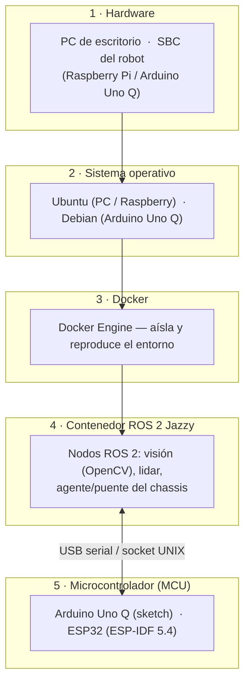

# 01 · Runbook — Instalación del entorno

Guía para dejar el workspace listo de cero. Antes de los pasos, conviene
entender **las capas** sobre las que corre todo: saber qué hace cada una te dice
exactamente qué tienes que instalar y por qué.

Al terminar tendrás el contenedor de ROS 2 Jazzy corriendo, el workspace
compilado y el comando `robot` disponible desde cualquier terminal.

---

## 1. Las capas del sistema

El proyecto es una pila de 5 capas. Cada una se apoya en la de abajo:



| # | Capa | Qué es | Por qué está |
|---|------|--------|--------------|
| 1 | **Hardware** | La máquina física: tu **PC** de escritorio o la **SBC** que va montada en el robot (Raspberry Pi o Arduino Uno Q). | Es donde corre todo. La PC procesa/visualiza; la SBC capta datos. |
| 2 | **Sistema operativo** | **Ubuntu** en la PC y en la Raspberry; **Debian** en el Arduino Uno Q. | Linux es la base sobre la que corre Docker. |
| 3 | **Docker** | Motor de contenedores. | **Aísla y reproduce** el entorno: la misma imagen corre igual en cualquier máquina, sin "en mi máquina sí funciona". No ensucias tu SO con dependencias de ROS. |
| 4 | **Contenedor ROS 2 Jazzy** | Un Ubuntu con ROS 2 Jazzy y todos los paquetes ya instalados. | Es donde viven tus **nodos**: la visión artificial (OpenCV), el driver del lidar, y el agente/puente que habla con el chassis. |
| 5 | **Microcontrolador (MCU)** | El firmware que mueve el hardware real: un **sketch** de Arduino (Uno Q) o un **proyecto ESP-IDF** (ESP32). | El MCU hace el trabajo de tiempo real (LED, motores, encoders). ROS 2 le habla por USB serial o socket UNIX. |

**Lo importante:** las capas 3–4 (Docker + ROS 2) son **idénticas** en la PC y en
la SBC — solo cambia la imagen que se levanta. Lo único específico de cada máquina
es la capa 1–2 (el hardware y su SO).

| | PC de escritorio | SBC del robot |
|---|---|---|
| Rol | Procesamiento pesado + visualización (RViz2, OpenCV) | Adquisición: cámara, lidar, puente al MCU |
| Contenedor | `robot dev` | `robot edge` / `robot rpi` / `robot uno_q` |
| MCU | — | ESP32 (`robot esp`) o Arduino Uno Q |

---

## 2. Prerrequisitos (instala cada capa)

Instala de la capa 1 hacia arriba. Los enlaces son a la **documentación oficial**.

### Capa 1–2 · Hardware + sistema operativo

Según dónde vayas a trabajar:

| Máquina | Sistema operativo | Documentación oficial |
|---|---|---|
| **PC de escritorio** | Ubuntu Desktop (22.04 o 24.04) | [Instalar Ubuntu Desktop](https://ubuntu.com/tutorials/install-ubuntu-desktop) |
| **Raspberry Pi** | Raspberry Pi OS **o** Ubuntu para Pi | [Docs de Raspberry Pi](https://www.raspberrypi.com/documentation/computers/getting-started.html) · [Ubuntu para Raspberry Pi](https://ubuntu.com/download/raspberry-pi) |
| **Arduino Uno Q** | Debian (viene con la placa) | [Docs del Arduino Uno Q](https://docs.arduino.cc/hardware/uno-q/) · [Manual de usuario](https://docs.arduino.cc/tutorials/uno-q/user-manual/) |

### Capa 3 · Docker

Instala Docker Engine siguiendo la guía oficial de tu SO:

- **[Instalar Docker Engine en Ubuntu](https://docs.docker.com/engine/install/ubuntu/)**
  (en Debian/Raspberry, elige tu distro en el menú de esa misma documentación).

Después, para usar `docker` **sin `sudo`** ([post-instalación oficial](https://docs.docker.com/engine/install/linux-postinstall/)):

```bash
sudo usermod -aG docker $USER
newgrp docker            # o cierra sesión y vuelve a entrar
docker run hello-world   # verifica que funciona
```

### Capa 4–5 · ROS 2 y el firmware del MCU

**No instalas nada de esto en tu máquina.** Todo vive dentro de contenedores:

- **ROS 2 Jazzy** → dentro del contenedor `robot dev` / `robot edge`.
- **ESP-IDF 5.4** (firmware ESP32) → dentro del contenedor `robot esp`.
- **Arduino IDE/CLI** (sketch del Uno Q) → según el flujo de Arduino.

Solo como referencia: [documentación de ROS 2 Jazzy](https://docs.ros.org/en/jazzy/).

### Otros prerrequisitos

- **git** instalado: `sudo apt update && sudo apt install -y git`
- Una **cuenta de GitHub** (para el fork).
- Tu **webcam identificada** → ver [`05-runbook-webcam.md`](./05-runbook-webcam.md).

---

## 3. Clonar el repositorio

1. Haz **fork** del [repositorio original](https://github.com/chucholoport/ros2_jazzy_ws)
   (botón *Fork* → *Create fork*). Queda en `https://github.com/TU_USUARIO/ros2_jazzy_ws`.

2. Clónalo:

   ```bash
   cd ~
   git clone https://github.com/TU_USUARIO/ros2_jazzy_ws.git
   cd ros2_jazzy_ws
   ```

> No hace falta inicializar submódulos a mano: lo hace `install.sh` (paso 4).

---

## 4. Ejecutar `install.sh`

Un solo script deja el repo listo:

```bash
./install.sh
source ~/.bashrc      # activa el comando robot en tu terminal actual
```

### Qué hace `install.sh`, paso a paso

Es **idempotente**: puedes correrlo varias veces sin duplicar nada.

1. **Localiza la raíz del repo** (funciona lo llames desde donde lo llames).

2. **Inicializa y actualiza los submódulos:**

   ```bash
   git submodule update --init --recursive
   ```

   El repo no guarda una copia de los submódulos, solo un puntero. Este paso los
   **descarga** de verdad:

   | Submódulo | Qué es |
   |---|---|
   | `ros2_ws/src/turtlebot_core` | El paquete ROS 2 principal (launch, nodos, `robot.ini`) |
   | `ros2_ws/src/uno_q_bridge` | El puente ROS ↔ Arduino Uno Q |
   | `esp32_ws/chassis/components/micro_ros_espidf_component` | El componente micro-ROS para la ESP32 |

   > `--recursive` es clave: `micro_ros_espidf_component` es un submódulo **dentro
   > de** otro, y sin `--recursive` no se bajaría.

3. **Instala el comando `robot` en tu `~/.bashrc`** — pero **solo si no está**
   (lo detecta con `grep`, para no duplicarlo en cada corrida). Lo que agrega es
   esta función:

   ```bash
   robot() {
       if [ -f ".docker/scripts/robot" ]; then
           bash .docker/scripts/robot "$@"
       else
           echo "robot: no estás dentro de un proyecto de robótica"
       fi
   }
   ```

4. **Recarga tu `~/.bashrc`.** Ojo: ese `source` corre dentro del propio script,
   así que **no afecta a tu terminal actual**. Por eso, después de `./install.sh`,
   ejecuta tú mismo `source ~/.bashrc` (o abre una terminal nueva).

### El comando `robot`

`robot` es un lanzador **sensible al contexto**: desde la raíz del proyecto
levanta el contenedor Docker que le pidas, sin ensuciar el `PATH`. Verifícalo:

```bash
robot           # imprime el menú de subcomandos
```

| Comando | Dónde | Qué hace |
|---|---|---|
| `robot dev` | PC | Contenedor de desarrollo (RViz2, OpenCV) |
| `robot edge` | SBC | Contenedor de adquisición (edge genérico) |
| `robot rpi` | Raspberry Pi | Contenedor de adquisición (Raspberry) |
| `robot uno_q` | Arduino Uno Q | Contenedor de adquisición (Uno Q) |
| `robot esp` | firmware | Contenedor ESP-IDF 5.4 para flashear la ESP32 |
| `robot rm` | — | Elimina el contenedor y libera espacio |

Más detalle en [`robot-command.md`](./robot-command.md).

---

## 5. Levantar el contenedor y compilar (en la PC)

```bash
robot dev
```

La **primera vez** construye la imagen `ubuntu_desktop-ros2` (clona y compila el
agente micro-ROS, drivers, etc.); puede tardar varios minutos. Las siguientes
solo arranca el contenedor y te deja una shell dentro, en `/ros2_ws`.

Ya dentro del contenedor, compila el workspace:

```bash
cd /ros2_ws
colcon build --symlink-install
source install/setup.bash
ros2 pkg list | grep turtlebot_core     # verifica que el paquete está
```

> `--symlink-install` enlaza los archivos en vez de copiarlos: al editar código
> Python, launch o `robot.ini`, los cambios se toman **sin reconstruir**.

Abre RViz2 (se arma solo según tu `robot.ini`):

```bash
ros2 launch turtlebot_core host.launch.py
```

---

## 6. Desplegar en la SBC del robot

En la SBC la instalación es **la misma** (pasos 3–4: clonar y `./install.sh`),
pero levantas el contenedor de tu placa en vez de `robot dev`:

```bash
robot edge          # o: robot rpi  /  robot uno_q
cd /ros2_ws
colcon build --symlink-install && source install/setup.bash
ros2 launch turtlebot_core edge.launch.py
```

Como PC y SBC comparten `ROS_DOMAIN_ID=0` y usan red host, la PC **ve** los topics
de la SBC (`/image_raw`, `/scan`, …) sin configuración extra.

> ### ⚠️ No corras `robot dev` en la SBC
>
> La imagen de `robot dev` trae el escritorio completo de ROS 2 (RViz2, OpenCV,
> simuladores). En una Raspberry **la construcción o la ejecución puede agotar la
> RAM y colgar/crashear el sistema por falta de recursos**. En la SBC usa
> **siempre** `robot edge` / `robot rpi` / `robot uno_q`.

---

## Instalación completa ✅

Ya tienes las 5 capas en su sitio: el comando `robot`, el contenedor de ROS 2
Jazzy construido, el workspace compilado y (si aplica) la SBC lista para captar.

### Siguientes pasos

- Conectar las máquinas por la red ROS (DDS) → [`03-runbook-conectividad.md`](./03-runbook-conectividad.md)
- Entender la arquitectura de red antes de programar → [`04-runbook-red-ros.md`](./04-runbook-red-ros.md)
- Identificar y configurar tu webcam → [`05-runbook-webcam.md`](./05-runbook-webcam.md)
- Firmware del MCU → `esp32_ws/led` · `esp32_ws/chassis` (ESP32) o `sketch/` (Uno Q)

### Comandos útiles del día a día

```bash
robot dev    # PC: desarrollo (procesamiento + visualización)
robot edge   # SBC: adquisición (cámara + lidar + MCU, sin monitor)
robot rpi    # Raspberry Pi: adquisición (cámara + lidar + MCU, sin monitor)
robot uno_q  # Arduino Uno Q: adquisición (cámara + lidar + MCU, sin monitor)
robot esp    # firmware ESP32 / ESP-IDF
robot rm     # elimina el contenedor para liberar espacio
```
