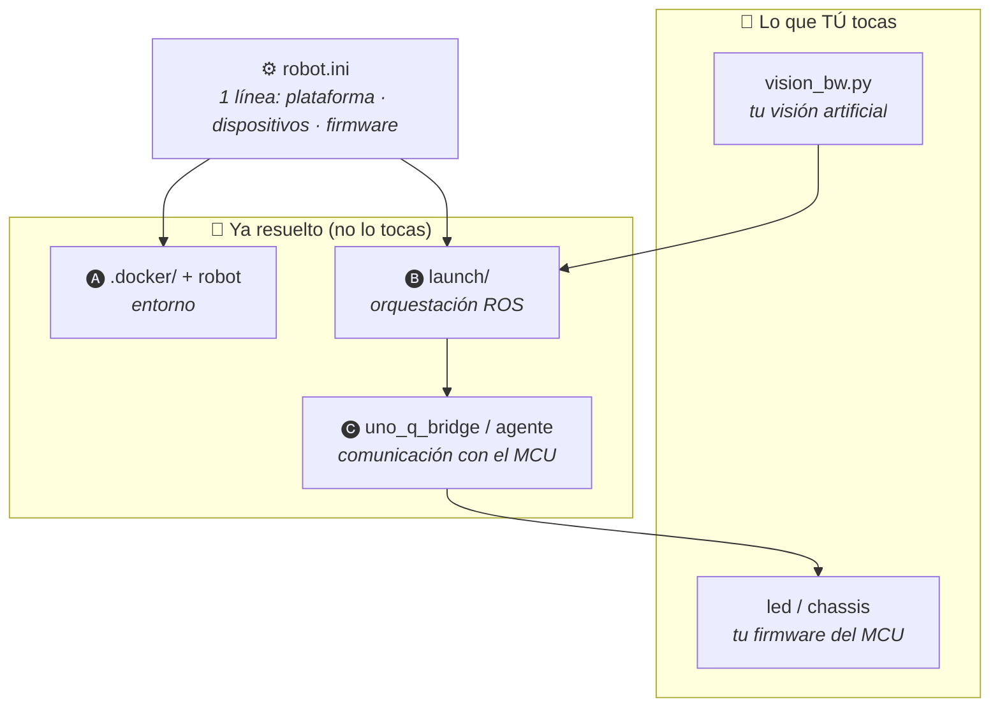

# 02 · Runbook — Arquitectura del repositorio

Esta guía explica **cómo está organizado el repo**: para qué sirve cada carpeta
y, sobre todo, las **capas de abstracción** que montamos para que tú, como
alumno, solo tengas que tocar **dos cosas**:

> ### 🎯 Tú solo modificas
> 1. **Un script** — tu nodo de visión: `vision_bw.py`
> 2. **Un firmware** — tu variante del MCU: `led` o `chassis` (Arduino o ESP32)
>
> Todo lo demás (Docker, ROS, red, comunicación con el hardware) **ya está
> resuelto** por las capas de abajo. Lo configuras con **una línea** en
> `robot.ini`, sin escribir código.
>
> Esto vale mientras uses las **variantes provistas** (`led` / `chassis`). Si
> agregas un firmware o un script **nuevo**, entonces sí tocas algunos launch
> files y el `setup.py` — ver la **sección 4**.

> ⚠️ **Ojo:** esta es la arquitectura del **repositorio**. La arquitectura de la
> **red ROS** (nodos, topics, grafo) está en
> [`runbook-arquitectura.md`](./runbook-arquitectura.md).

---

## 1. Mapa del repositorio

```
ros2_jazzy_ws/
├── install.sh                    # instala submódulos + comando robot (ver runbook 01)
├── README.md                     # portada: distribución del sistema y grafo ROS
├── docs/                         # los runbooks (incluido este)
│
├── .docker/                      # 🅐 CAPA ENTORNO — todo lo de Docker
│   ├── scripts/                  #    robot, dev, edge, rpi, uno_q, esp, rm, .config
│   ├── ubuntu_desktop/           #    imagen de la PC (RViz2, OpenCV)
│   ├── ubuntu_edge/              #    imagen edge genérico
│   ├── ubuntu_raspberry_pi/      #    imagen Raspberry Pi
│   ├── ubuntu_uno_q/             #    imagen Arduino Uno Q
│   └── esp32/                    #    imagen ESP-IDF 5.4 (firmware)
│
├── ros2_ws/                      # workspace de ROS 2 (se compila con colcon)
│   └── src/
│       ├── turtlebot_core/       # 🅑 CAPA ROS — el paquete principal
│       │   ├── robot.ini         #    ⚙️ CONFIG: plataforma + dispositivos + firmware
│       │   ├── launch/           #    orquestadores: edge · host · mcu · rplidar · webcam
│       │   ├── turtlebot_core/   #    nodos Python:
│       │   │   ├── vision_bw.py  #      👈 TU SCRIPT (visión artificial)
│       │   │   ├── control_led.py#      demo: publica /set_led a mano
│       │   │   └── toggle_led.py #      demo: publica /set_led en bucle
│       │   └── rviz/             #    bloques de RViz (base/camera/rplidar) → turtlebot.rviz
│       └── uno_q_bridge/         # 🅒 CAPA COMUNICACIÓN — puente ROS ↔ Arduino Uno Q
│
├── esp32_ws/                     # firmware para ESP32 (ESP-IDF 5.4) 
|   |                             # 🅒 CAPA COMUNICACIÓN — agente microROS
│   ├── led/                      #    👈 FIRMWARE: solo LED
│   └── chassis/                  #    👈 FIRMWARE: TurtleBot completo (ruedas)
│
└── sketch/                       # firmware para Arduino Uno Q (Arduino IDE)
    ├── led/led.ino               #    👈 FIRMWARE: solo LED
    └── chassis/chassis.ino       #    👈 FIRMWARE: TurtleBot completo (ruedas)
```

---

## 2. Las capas de abstracción

La idea es que cada capa **responde una pregunta técnica por ti**, para que no
tengas que preocuparte por ella:

| Pregunta que NO tienes que resolver | La resuelve | Capa |
|---|---|---|
| ¿Cómo instalo ROS 2 / Docker / drivers? | `.docker/` + comando `robot` | 🅐 Entorno |
| ¿Qué nodos levanto y con qué parámetros? | `launch/` (edge · host · mcu) | 🅑 ROS |
| ¿Qué hardware tiene MI robot? | `robot.ini` (una línea por dispositivo) | ⚙️ Config |
| ¿Cómo hablo con el microcontrolador? | `uno_q_bridge` / micro-ROS agent | 🅒 Comunicación |
| **¿Qué ve y decide el robot?** | **TÚ → `vision_bw.py`** | 🎯 Tu código |
| **¿Cómo mueve el hardware?** | **TÚ → tu firmware** | 🎯 Tu código |



### 🅐 Capa Entorno — `.docker/`

Contiene una **imagen por plataforma** y los **scripts** que las manejan. El
comando `robot` (que instala `install.sh`) es la puerta de entrada: `robot dev`,
`robot edge`, `robot esp`… Tú nunca instalas ROS ni compilas imágenes a mano.

- `scripts/.config` — nombres de contenedor/imagen por plataforma.
- `scripts/robot` — despacha al script correcto según el subcomando.
- `ubuntu_*/` y `esp32/` — un `Dockerfile` + `docker-compose.yml` por imagen.

### 🅑 Capa ROS — `ros2_ws/src/turtlebot_core/`

El paquete de ROS 2. Sus **launch son orquestadores**: no escribes nodos a mano,
solo declaras qué quieres en `robot.ini` y ellos arman todo.

- `launch/edge.launch.py` — **en el robot**: lee `robot.ini` y levanta solo los
  dispositivos conectados (rplidar, webcam, MCU).
- `launch/host.launch.py` — **en la PC**: arma un RViz a la medida (`turtlebot.rviz`)
  con los bloques de `rviz/` según `robot.ini`.
- `launch/mcu.launch.py` — el puente al microcontrolador (elige `backend` y
  `firmware`).
- `launch/rplidar.launch.py`, `webcam.launch.py` — drivers parametrizados.
- `turtlebot_core/vision_bw.py` — **el nodo que tú personalizas**.

### ⚙️ Capa Config — `robot.ini`

**Una sola fuente de verdad.** Con tres bloques le dices al sistema qué robot
tienes; los launch (edge y host) lo leen y se adaptan solos:

```ini
[platform]
backend  = microros   # microros (ESP32) | uno_q (Arduino Uno Q)
firmware = led        # led | chassis  (= la variante que flasheaste)

[devices]
rplidar = true        # qué tienes REALMENTE conectado
webcam  = true
chassis = true
```

### 🅒 Capa Comunicación — puente al MCU

Abstrae **cómo** ROS habla con el microcontrolador, que cambia según la placa:

- **Arduino Uno Q** → nodo `uno_q_bridge` (paquete `uno_q_bridge`), por socket UNIX.
- **ESP32** → `micro_ros_agent`, por serial/UDP; aquí el firmware **es** el nodo ROS.

Tú no tocas esta capa: `mcu.launch.py` levanta el puente correcto según
`robot.ini`.

---

## 3. Lo único que tú tocas

### 1️⃣ El script — `vision_bw.py`

`ros2_ws/src/turtlebot_core/turtlebot_core/vision_bw.py`

Tu nodo de visión. De fábrica solo pasa la cámara a blanco y negro; tú cambias
la función `on_image()` por tu lógica (detectar color, bordes, una línea…) y
publicas en `/set_led` o `/cmd_vel` para **actuar** sobre el robot.

### 2️⃣ El firmware — `led` o `chassis`

Según tu placa y lo que quieras (solo LED o ruedas):

| Placa | Solo LED | TurtleBot completo |
|---|---|---|
| **Arduino Uno Q** | `sketch/led/led.ino` | `sketch/chassis/chassis.ino` |
| **ESP32** | `esp32_ws/led/` | `esp32_ws/chassis/` |

Vienen listos con el enlace a ROS ya resuelto: tú solo ajustas pines/constantes
a tu hardware (ver los README de cada firmware).

### ⚙️ Y lo configuras (sin código) en `robot.ini`

`[platform] backend` + `firmware` deben coincidir con la placa y el firmware que
flasheaste; `[devices]` con lo que tengas conectado. Nada más.

---

## 4. Si vas más allá: extender el sistema

La regla de "2 archivos" vale porque el sistema ya trae **cableadas** las
variantes `led` y `chassis`. **Por tanto, si agregas algo NUEVO** —un firmware
que no existía o un nodo/script nuevo— tienes que registrarlo en la **capa de
orquestación** (los `launch/` y el `setup.py`). Aquí está exactamente dónde.

### 4.1 · Un script (nodo ROS) nuevo

Pon tu `.py` junto a los demás nodos
(`ros2_ws/src/turtlebot_core/turtlebot_core/`) y **regístralo como ejecutable**
en `setup.py` — es lo único obligatorio:

```python
# ros2_ws/src/turtlebot_core/setup.py
entry_points={
    'console_scripts': [
        'toggle_led = turtlebot_core.toggle_led:main',
        'control_led = turtlebot_core.control_led:main',
        'vision_bw = turtlebot_core.vision_bw:main',
        'mi_nodo = turtlebot_core.mi_nodo:main',   # 👈 tu nodo nuevo
    ],
},
```

Recompila y ya puedes correrlo:

```bash
colcon build --symlink-install && source install/setup.bash
ros2 run turtlebot_core mi_nodo
```

¿Quieres que se levante **solo** al abrir RViz? Agrégalo como `Node` en
`host.launch.py` (dentro de `_launch_setup`, en la lista que retorna):

```python
# ros2_ws/src/turtlebot_core/launch/host.launch.py
Node(
    package='turtlebot_core',
    executable='mi_nodo',
    name='mi_nodo',
    output='screen',
),
```

### 4.2 · Un firmware nuevo (variante del MCU)

Depende de la placa, porque la comunicación es distinta:

#### ESP32 — casi sin tocar launch

El `micro_ros_agent` es el **mismo** para cualquier firmware (recuerda: el
firmware *es* el nodo ROS). Así que:

1. Crea el proyecto `esp32_ws/<nombre>/` (copia de `led` o `chassis`).
2. En `mcu.launch.py` **solo** añades el nombre a `choices`, para poder
   seleccionarlo desde `robot.ini`:

```python
# ros2_ws/src/turtlebot_core/launch/mcu.launch.py
declare_firmware = DeclareLaunchArgument(
    'firmware',
    default_value='led',
    choices=['led', 'chassis', 'mi_firmware'],   # 👈 añade tu variante
    ...
)
```

No agregas nodos: el agente ya sirve para tu firmware.

#### Arduino Uno Q — sí tocas launch y el puente

Aquí el nodo ROS vive en Linux (el *bridge*), así que una variante nueva = un
**nodo nuevo**. Tres pasos:

1. Crea el sketch `sketch/<nombre>/<nombre>.ino`.
2. Crea su ejecutable puente en `uno_q_bridge` y regístralo en su `setup.py`:

```python
# ros2_ws/src/uno_q_bridge/setup.py
entry_points={
    'console_scripts': [
        'uno_q_bridge = uno_q_bridge.uno_q_bridge:main',
        'chassis_bridge = uno_q_bridge.chassis_bridge:main',
        'mi_bridge = uno_q_bridge.mi_bridge:main',   # 👈 tu puente nuevo
    ],
},
```

3. En `mcu.launch.py`, añade el valor a `choices` y un `Node` condicionado
   (calcado del de `chassis`), y mételo en el `return LaunchDescription([...])`:

```python
# ros2_ws/src/turtlebot_core/launch/mcu.launch.py
uno_q_mi_firmware_node = Node(
    name='uno_q_bridge',
    package='uno_q_bridge',
    executable='mi_bridge',
    output='screen',
    condition=IfCondition(PythonExpression([
        "'", backend, "' == 'uno_q' and '", firmware, "' == 'mi_firmware'",
    ])),
)
```

> **En una frase:** las variantes provistas no tocan `launch/`; una variante
> **nueva** se registra en `setup.py` (el ejecutable) y, si es Uno Q, además en
> `mcu.launch.py` (un `Node` con su condición).

---

## Resumen

| Carpeta / archivo | Para qué | ¿Lo tocas? |
|---|---|---|
| `.docker/` | Imágenes Docker + comando `robot` | ❌ |
| `install.sh` | Setup inicial (submódulos + `robot`) | ❌ |
| `ros2_ws/src/turtlebot_core/launch/` | Orquestadores ROS (edge/host/mcu) | ❌ |
| `ros2_ws/src/turtlebot_core/rviz/` | Bloques de RViz | ❌ (opcional) |
| `ros2_ws/src/uno_q_bridge/` | Puente ROS ↔ Uno Q | ❌ |
| **`.../turtlebot_core/vision_bw.py`** | **Tu visión artificial** | ✅ **script** |
| **`sketch/…` o `esp32_ws/…`** | **Tu firmware del MCU** | ✅ **firmware** |
| **`robot.ini`** | **Config del robot (plataforma/dispositivos/firmware)** | ✅ (config) |

> **Para extender** el sistema (un firmware o script **nuevo**, no las variantes
> provistas) también tocas `setup.py` y —si es Uno Q— `mcu.launch.py`. Ver la
> **sección 4**.

---

## Siguientes pasos

- Cómo se conectan los nodos y topics (arquitectura de la red ROS) →
  [`runbook-arquitectura.md`](./runbook-arquitectura.md)
- Identificar y configurar tu webcam → [`runbook-webcam.md`](./runbook-webcam.md)
