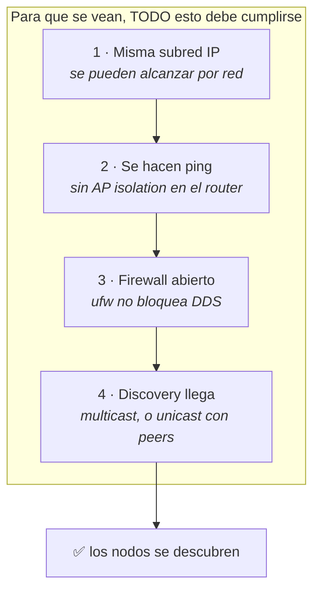

# 03 · Runbook — Conectividad ROS 2 entre máquinas (DDS)

Esta guía explica cómo lograr que **dos máquinas** (tu PC con `robot dev` y la SBC
del robot con `robot edge`) se **vean** en la misma red ROS 2 y compartan topics,
aunque estén conectadas por un WiFi doméstico.

Al terminar, un `talker` en una máquina llegará al `listener` de la otra, y en la
PC verás los topics de la SBC (`/image_raw`, `/scan`, `/chassis/heartbeat`…) sin
configuración extra.

---

## 1. Cómo se descubren los nodos: DDS

ROS 2 no usa un "servidor central". Cada nodo anuncia su existencia por la red y
los demás lo **descubren solos**. Ese mecanismo es **DDS** (el middleware por
debajo de ROS 2). Para que dos máquinas se vean tienen que cumplirse **cuatro
condiciones**, y basta que falle una para que "no conecten":



| # | Condición | Cómo se rompe en casa |
|---|---|---|
| 1 | **Misma subred** | Una máquina en la red normal y otra en la de invitados, o máscaras distintas. |
| 2 | **Ping mutuo** | El router tiene *AP isolation* (aísla clientes WiFi entre sí). |
| 3 | **Firewall** | `ufw` activo en alguna máquina bloquea los puertos DDS. |
| 4 | **Discovery** | El multicast no viaja bien por WiFi → hay que forzar unicast. |

Además, las dos máquinas deben compartir el mismo **`ROS_DOMAIN_ID`** (en este
proyecto es `0`, ya fijado en los `docker-compose.yml`).

> Este runbook está ordenado igual que el diagnóstico real: se valida capa por
> capa, de abajo hacia arriba. **No saltes pasos**: cada uno descarta una causa.

---

## 2. Diagnóstico paso a paso

Todos los comandos de red (`ip`, `ping`, `ufw`) se corren en el **host** (fuera
del contenedor). Los de ROS (`ros2 …`) se corren **dentro** del contenedor.

### Paso 1 · ¿Misma subred? — `ip -4 addr show`

En **cada** máquina, fuera del contenedor:

```bash
ip -4 addr show | grep inet
```

Fíjate en la línea de tu interfaz **WiFi** (`wlan0`, `wlp1s0`…). Ejemplo real:

```
# Máquina A (robot):   inet 192.168.68.55/22 ... wlan0
# Máquina B (PC):      inet 192.168.68.60/22 ... wlp1s0
```

Las dos IPs deben caer en la **misma subred**. Con máscara `/22`, el rango
`192.168.68.x`–`192.168.71.x` es la misma red → ✔️. Si una fuera `192.168.0.x` y
otra `192.168.1.x`, o una `10.x` de invitados → **no se verán nunca**; conéctalas
al mismo WiFi/subred antes de seguir.

> Verás también interfaces `docker0`, `br-...`, `vmnet...` (172.x). Son **redes
> virtuales locales** (Docker, VMware); ignóralas para esto. Eso sí, si hay muchas
> pueden confundir al discovery — lo resolvemos en el paso 4 con unicast.

**Apunta la IP WiFi de cada máquina; las usarás en el paso 4.**

### Paso 2 · ¿Se hacen ping? — descarta AP isolation

Desde cada máquina, haz ping a la **IP WiFi de la otra**:

```bash
# En B, hacia A:
ping -c3 192.168.68.55
# En A, hacia B:
ping -c3 192.168.68.60
```

- **Responde** → red OK, sigue al paso 3.
- **No responde** (pero están en la misma subred) → el router tiene **AP
  isolation** (aislamiento de clientes). Ninguna config de ROS lo arregla:
  - Desactiva "AP isolation" / "aislamiento de clientes" en el router, **o**
  - conecta ambas por cable al mismo switch, **o**
  - usa un hotspot dedicado para el laboratorio.

### Paso 3 · Firewall — `ufw status`

En **cada** máquina (host):

```bash
sudo ufw status
```

- `inactivo` o `command not found` → no hay firewall estorbando, sigue.
- `activo` → **está bloqueando el DDS entrante.** Para el laboratorio, lo más
  simple es desactivarlo:

  ```bash
  sudo ufw disable
  ```

> **Este suele ser el culpable.** DDS abre muchos puertos UDP dinámicos; un `ufw`
> activo deja salir los paquetes pero bloquea las **respuestas** del otro extremo,
> y el discovery nunca se completa. En un entorno de clase, `ufw disable` es lo
> práctico. Si necesitas mantenerlo activo, abre los puertos de discovery:
> `sudo ufw allow 7400:7500/udp` (más el rango de datos según tu config), pero es
> más engorroso.

### Paso 4 · Discovery — confirma RMW/DOMAIN y fuerza unicast

Primero verifica que ambos contenedores hablan el mismo idioma. **Dentro de cada
contenedor:**

```bash
echo "RMW=$RMW_IMPLEMENTATION  DOMAIN=$ROS_DOMAIN_ID  PEERS=$ROS_STATIC_PEERS"
```

- `DOMAIN` debe ser **`0`** en ambos (lo fija el `docker-compose.yml`).
- `RMW` **vacío** = Fast DDS (el rmw por defecto de Jazzy). Correcto para lo que
  sigue. Si dijera `rmw_cyclonedds_cpp`, `ROS_STATIC_PEERS` **no** aplica y habría
  que configurar Cyclone aparte — no es nuestro caso.

Ahora fuerza el descubrimiento por **unicast**, apuntando cada máquina a la IP
WiFi de la **otra**. Esto evita depender del multicast del WiFi (paso 4 del
diagrama) y de las interfaces virtuales que enredan al discovery.

> ⚠️ **Debe ir en AMBOS sentidos.** Es el error más común: poner `PEERS` solo en
> una máquina. Cada lado necesita saber dónde está el otro.

```bash
# --- Dentro del contenedor de la Máquina A (192.168.68.55) ---
export ROS_STATIC_PEERS=192.168.68.60

# --- Dentro del contenedor de la Máquina B (192.168.68.60) ---
export ROS_STATIC_PEERS=192.168.68.55
```

`ROS_STATIC_PEERS` es nativo de ROS 2 Jazzy con Fast DDS: añade ese IP como peer
de descubrimiento por unicast, sin necesidad de archivos XML.

> **Importante:** exporta la variable en la **misma terminal** donde vas a lanzar
> los nodos. Si abres otra shell al contenedor (`docker exec …`), esa no la tiene.

---

## 3. Verificar que conectan

Con los pasos anteriores hechos, prueba el discovery de punta a punta:

```bash
# Terminal en el contenedor A (con su PEERS exportado):
ros2 run demo_nodes_cpp talker

# Terminal en el contenedor B (con su PEERS exportado):
ros2 run demo_nodes_cpp listener
```

Si el `listener` empieza a imprimir `I heard: [Hello World: N]` → **conectan**. 🎉

Otra comprobación útil, ya con la captura corriendo en la SBC:

```bash
# En la PC:
ros2 topic list         # deben aparecer /image_raw, /scan, /chassis/heartbeat…
ros2 node list          # deben verse los nodos de la otra máquina
```

### Si el multicast SÍ funcionara (opcional)

Para saber si tu red permite multicast (y podrías ahorrarte el `PEERS`), prueba:

```bash
# En el contenedor A:
ros2 multicast receive
# En el contenedor B:
ros2 multicast send
```

Si A recibe el mensaje, el multicast pasa por tu red. En WiFi doméstico
normalmente **no** pasa de forma fiable, por eso usamos unicast con
`ROS_STATIC_PEERS`.

---

## 4. Que no se te olvide en cada arranque

`ROS_STATIC_PEERS` exportado a mano **se pierde al cerrar la terminal**. Opciones
para no repetirlo:

- **Rápido (por sesión):** vuelve a exportarlo al abrir el contenedor.
- **Cómodo:** agrégalo al `~/.bashrc` **dentro** del contenedor, o al bloque
  `environment:` del `docker-compose.yml` de esa máquina, con la IP del otro
  equipo. Recuerda que el IP puede cambiar (DHCP); si eso pasa, actualízalo.

> 💡 Para que la IP sea estable, reserva una **IP fija por DHCP** en el router
> (por dirección MAC) para cada máquina. Así el `PEERS` no cambia entre clases.

---

## Resumen del diagnóstico

| Paso | Comando | Qué descarta | Fix si falla |
|---|---|---|---|
| 1 | `ip -4 addr show` | Subredes distintas | Mismo WiFi/subred |
| 2 | `ping <IP otra>` | AP isolation | Desactivar aislamiento / cable |
| 3 | `sudo ufw status` | Firewall bloqueando DDS | `sudo ufw disable` |
| 4 | `echo $RMW…` + `export ROS_STATIC_PEERS` | Multicast no fiable / interfaces | Unicast en **ambos** lados |
| ✅ | `talker` / `listener` | — | Conectan |

En nuestro caso real el problema eran **dos cosas a la vez**: `ufw` activo en la
PC (paso 3) y `ROS_STATIC_PEERS` puesto solo en un lado (paso 4). Corregidas
ambas, el sistema conectó.

---

## Siguientes pasos

- Arquitectura del repositorio →
  [`02-runbook-arquitectura.md`](./02-runbook-arquitectura.md)
- Arquitectura de la red ROS (nodos, topics, grafo) →
  [`04-runbook-red-ros.md`](./04-runbook-red-ros.md)
- Identificar y configurar tu webcam → [`05-runbook-webcam.md`](./05-runbook-webcam.md)
