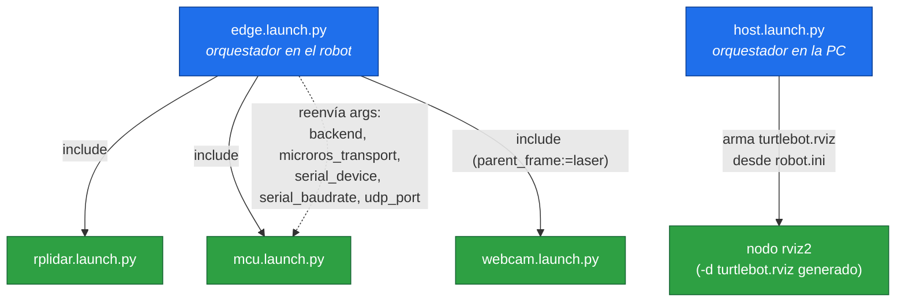
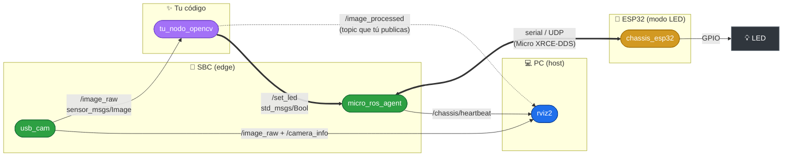
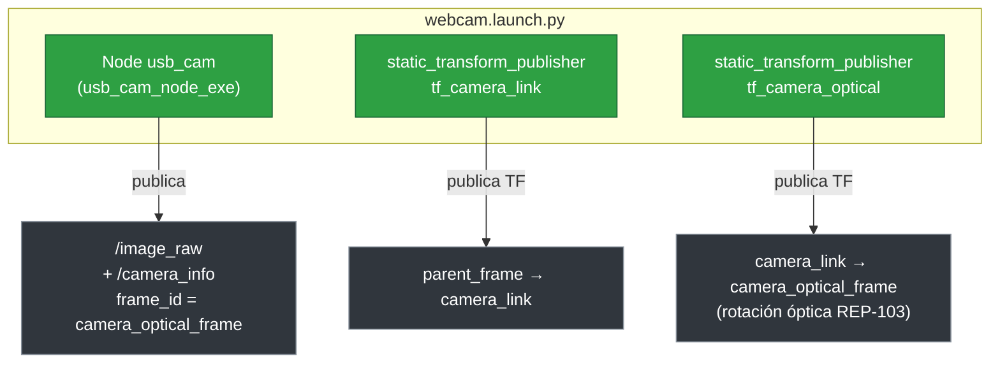
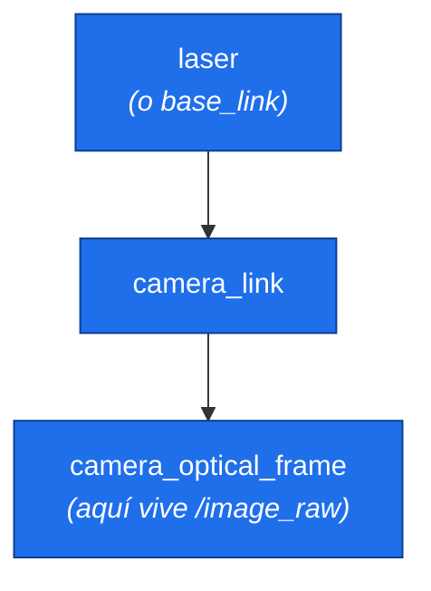
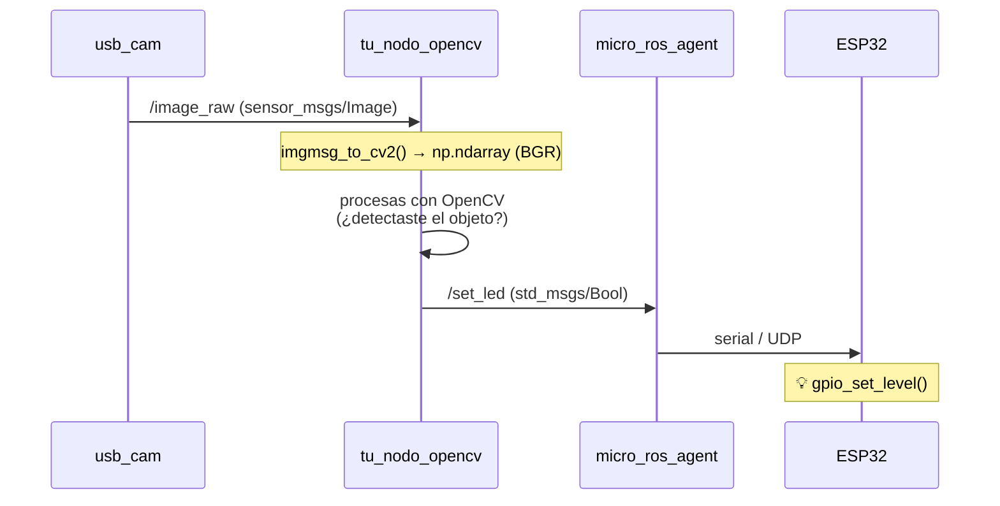
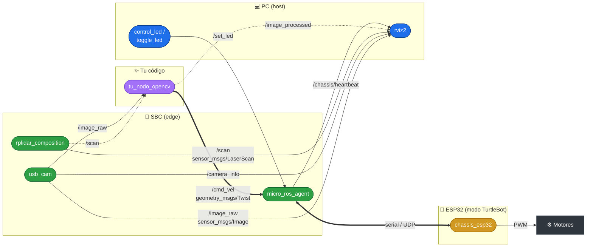
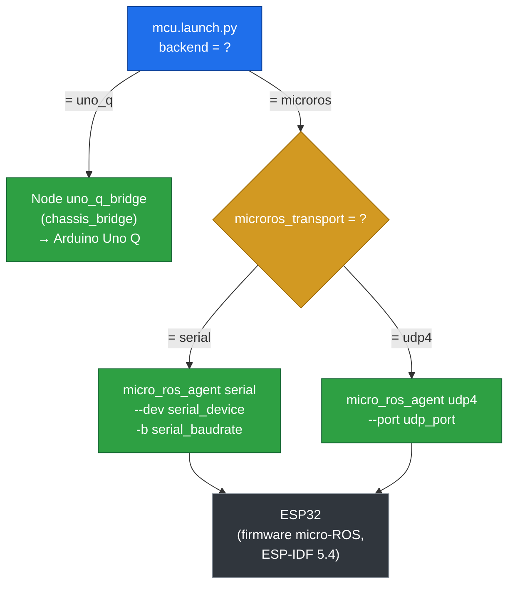
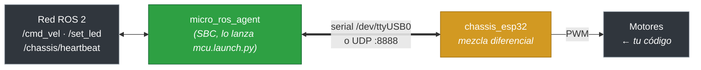

# 04 · Runbook — Red ROS del paquete `turtlebot_core`

Este runbook explica cómo está estructurado el paquete `turtlebot_core` y, sobre
todo, **cómo fluye la información por la red de ROS 2** (nodos, topics y TF).

> Los diagramas están en [Mermaid](https://mermaid.js.org/). Se renderizan solos
> en GitHub y en VSCode (con la vista previa de Markdown).

---

## Las dos configuraciones del proyecto

El mismo repositorio soporta **dos escenarios**. Empieza por el A; el B es el
robot completo.

| | **A · Base de visión artificial** | **B · TurtleBot completo** |
|---|---|---|
| **Objetivo** | Que tu nodo de OpenCV **actúe** sobre el hardware | Robot móvil completo |
| **Hardware** | Webcam + ESP32 con un LED | Webcam + rplidar + ESP32 + chasis con ruedas |
| **Firmware ESP32** | proyecto `esp32_ws/led` | proyecto `esp32_ws/chassis` |
| **Actúas publicando** | `/set_led` (`std_msgs/Bool`) | `/cmd_vel` (`geometry_msgs/Twist`) |
| **Sección** | [Parte A](#parte-a--base-de-conexión-de-visión-artificial) | [Parte B](#parte-b--turtlebot-completo) |

La idea es que **no necesitas motores para cerrar el ciclo completo**
percepción → decisión → actuación: en el modo A, tu nodo detecta algo con OpenCV
y enciende un LED en la ESP32. La arquitectura de red es idéntica; lo único que
cambia es qué topic publicas.

---

# Parte común

## 1. Qué es cada archivo del paquete

```
turtlebot_core/
├── launch/
│   ├── edge.launch.py     ← ENTRADA en el robot: rplidar + chassis + webcam
│   ├── host.launch.py     ← ENTRADA en la PC: RViz2 (arma turtlebot.rviz)
│   ├── rplidar.launch.py            ← driver del rplidar          → /scan
│   ├── mcu.launch.py            ← backend del chassis (conmutable)
│   ├── webcam.launch.py             ← driver de la cámara + TF  → /image_raw
│   └── remote_chassis.launch.py     ← teleop (teclado → /cmd_vel)
├── rviz/                            ← bloques que host.launch.py fusiona
│   ├── base.rviz                    ← escena base (Grid + TF)
│   ├── rplidar.rviz                 ← bloque LaserScan (/scan)
│   ├── camera.rviz                  ← bloque Image + Camera (/image_raw)
│   └── (turtlebot.rviz)             ← generado al vuelo según robot.ini
├── turtlebot_core/
│   ├── control_led.py               ← nodo: publica /set_led (manual)
│   └── toggle_led.py                ← nodo: publica /set_led (automático)
├── package.xml / setup.py           ← metadatos y build del paquete
└── README.md
```

Hay **dos puntos de entrada** según dónde ejecutes:

| Launch                     | ¿Dónde corre? | ¿Qué levanta? |
|----------------------------|---------------|---------------|
| `edge.launch.py` | En el robot (SBC) | Sensores y actuadores (rplidar, chassis, cámara) |
| `host.launch.py` | En tu PC      | Herramientas de visualización (RViz2) |

Ambos hablan por la **misma red de ROS 2** (DDS), así que la PC "ve" los topics
que publica el robot sin configuración extra (misma `ROS_DOMAIN_ID`).

---

## 2. Jerarquía de los launch (quién incluye a quién)

`edge.launch.py` es un **orquestador**: no crea nodos directamente,
sino que incluye a los otros tres launch y les reenvía argumentos.



> En el host, el `chassis` está **comentado** a propósito: su backend depende de
> la plataforma física, por eso se lanza desde el edge.

---

# Parte A · Base de conexión de visión artificial

> **Meta:** tu nodo de OpenCV ve algo por la webcam y enciende el LED de la
> ESP32. Sin motores, sin rplidar.
>
> **Firmware:** proyecto `esp32_ws/led` (o el sketch `sketch/led/led.ino` en el Uno Q).

## A1. La red de nodos y topics

Este es el grafo que verías con `rqt_graph`. Los óvalos son **nodos**, las
flechas etiquetadas son **topics**.



> El `micro_ros_agent` es un **puente**, no un nodo con lógica: los topics de la
> ESP32 aparecen en la red de ROS 2 como si fueran de cualquier otro nodo. Por
> eso tu nodo publica `/set_led` directamente, sin saber que del otro lado hay
> un microcontrolador.

**Topics de la Parte A:**

| Topic                | Tipo                     | Dirección | Para qué |
|----------------------|--------------------------|-----------|----------|
| `/image_raw`         | `sensor_msgs/Image`      | ← `usb_cam` | La imagen cruda (aquí te suscribes) |
| `/camera_info`       | `sensor_msgs/CameraInfo` | ← `usb_cam` | Calibración/intrínsecos |
| `/set_led`           | `std_msgs/Bool`          | → ESP32   | **Tu actuación**: enciende/apaga el LED |
| `/chassis/heartbeat` | `std_msgs/Int32`         | ← ESP32   | Contador 1 Hz: verifica que el enlace vive |

---

## A2. Detalle: `webcam.launch.py`

Levanta **3 procesos**: el driver de la cámara y dos publicadores de transformada
estática (TF). La imagen se publica con `frame_id = camera_optical_frame` para
que RViz2 la oriente bien.



**Argumentos configurables** (con `arg:=valor`):

| Argumento       | Default                | Descripción |
|-----------------|------------------------|-------------|
| `video_device`  | `/dev/video0`          | Dispositivo V4L2 (usa la ruta `by-id`) |
| `parent_frame`  | `base_link`            | Frame padre en el árbol TF (el edge lo fija en `laser`) |
| `camera_frame`  | `camera_link`          | Frame físico de la cámara |
| `optical_frame` | `camera_optical_frame` | Frame óptico con el que se publica la imagen |

### Árbol de TF resultante



> El default (`base_link`) aplica cuando lanzas la cámara sola. En el edge se usa
> `parent_frame:=laser` para colgarla del frame del rplidar y que el árbol quede
> conectado.

---

## A3. Dónde entra TU nodo de OpenCV

Tu nodo es **un suscriptor más** de `/image_raw`. No tienes que tocar
`webcam.launch.py` ni el firmware: te conectas a los topics que ya existen.



Esqueleto de un nodo que **ve y actúa** (rclpy + cv_bridge):

```python
import rclpy
from rclpy.node import Node
from sensor_msgs.msg import Image
from std_msgs.msg import Bool
from cv_bridge import CvBridge
import cv2


class VisionNode(Node):
    def __init__(self):
        super().__init__('tu_nodo_opencv')
        self.bridge = CvBridge()
        # Entrada: la imagen que ya publica usb_cam
        self.sub = self.create_subscription(
            Image, '/image_raw', self.on_image, 10)
        # Salidas: imagen procesada (para ver) y LED (para actuar)
        self.img_pub = self.create_publisher(Image, '/image_processed', 10)
        self.led_pub = self.create_publisher(Bool, '/set_led', 10)

    def on_image(self, msg):
        frame = self.bridge.imgmsg_to_cv2(msg, desired_encoding='bgr8')

        # --- tu procesamiento OpenCV aquí ---
        gray = cv2.cvtColor(frame, cv2.COLOR_BGR2GRAY)
        detectado = bool(gray.mean() > 100)      # ejemplo trivial
        out = cv2.cvtColor(gray, cv2.COLOR_GRAY2BGR)
        # -------------------------------------

        # Actúas sobre el hardware
        self.led_pub.publish(Bool(data=detectado))

        # Publicas la imagen procesada para verla en RViz2
        out_msg = self.bridge.cv2_to_imgmsg(out, encoding='bgr8')
        out_msg.header = msg.header   # conserva timestamp y frame_id
        self.img_pub.publish(out_msg)


def main():
    rclpy.init()
    rclpy.spin(VisionNode())
    rclpy.shutdown()
```

> Conserva `msg.header` en tu salida: así tu imagen procesada mantiene el
> `frame_id = camera_optical_frame` y RViz2 la ubica en el árbol de TF igual que
> `/image_raw`.

---

## A4. Flujo de trabajo (Parte A)

1. **Flashea la ESP32** en modo LED (es el default):

   ```bash
   robot esp
   cd /project/chassis && idf.py set-target esp32 && idf.py build
   idf.py -p /dev/ttyUSB0 flash monitor
   ```

   Detalles: `esp32_ws/chassis/README.md`

2. **Levanta el agente** (conecta la ESP32 a la red de ROS 2):

   ```bash
   ros2 launch turtlebot_core mcu.launch.py \
     backend:=microros microros_transport:=serial
   ```

3. **Levanta la cámara**:

   ```bash
   ros2 launch turtlebot_core webcam.launch.py \
     video_device:=/dev/v4l/by-id/<tu-camara>-video-index0
   ```

   (Identificar la cámara → [`05-runbook-webcam.md`](./05-runbook-webcam.md))

4. **Verifica que ambos extremos viven**:

   ```bash
   ros2 topic hz /image_raw            # ~30 Hz
   ros2 topic echo /chassis/heartbeat  # contador subiendo
   ros2 topic pub --once /set_led std_msgs/Bool "{data: true}"   # 💡
   rqt_graph                           # ve el grafo completo
   ```

5. **Escribe tu nodo** (sección A3) y córrelo.

6. **Visualiza** en RViz2 (lo levanta `host.launch.py` desde la PC) agregando un
   display *Image* con tu `/image_processed`.

---

# Parte B · TurtleBot completo

> **Meta:** el robot móvil completo — rplidar, chasis con ruedas y navegación.
>
> **Firmware:** proyecto `esp32_ws/chassis` (o el sketch `sketch/chassis/chassis.ino` en el Uno Q).

Todo lo de la Parte A sigue aplicando. Lo que se **agrega** es el rplidar
(`/scan`) y el control de ruedas (`/cmd_vel`).

## B1. La red completa



**Topics que se agregan respecto a la Parte A:**

| Topic      | Tipo                    | Dirección | Para qué |
|------------|-------------------------|-----------|----------|
| `/scan`    | `sensor_msgs/LaserScan` | ← rplidar | Barrido del rplidar (obstáculos) |
| `/cmd_vel` | `geometry_msgs/Twist`   | → ESP32   | **Tu actuación**: velocidad (v, ω) |

---

## B2. Detalle: `mcu.launch.py` (backend conmutable)

El chassis puede hablar con **dos hardwares distintos**. El launch elige cuál
levantar según el argumento `backend`, usando condiciones (`IfCondition`)
— por eso solo arranca el nodo que corresponde.



**Argumentos:**

| Argumento            | Default        | Choices          | Aplica cuando |
|----------------------|----------------|------------------|---------------|
| `backend`    | `uno_q`        | `uno_q`, `microros` | siempre |
| `microros_transport` | `serial`       | `serial`, `udp4` | `backend=microros` |
| `serial_device`      | `/dev/ttyUSB0` | —                | transporte `serial` |
| `serial_baudrate`    | `115200`       | —                | transporte `serial` |
| `udp_port`           | `8888`         | —                | transporte `udp4` |

Ejemplos:

```bash
# Arduino Uno Q
ros2 launch turtlebot_core mcu.launch.py backend:=uno_q

# ESP32 por serial
ros2 launch turtlebot_core mcu.launch.py \
  backend:=microros microros_transport:=serial serial_device:=/dev/ttyUSB0

# ESP32 por WiFi (UDP)
ros2 launch turtlebot_core mcu.launch.py \
  backend:=microros microros_transport:=udp4 udp_port:=8888
```

---

## B3. Del `/cmd_vel` a las ruedas

El `micro_ros_agent` solo es el puente; quien convierte el `Twist` en giro de
ruedas es el **firmware** de `esp32_ws/chassis/`.



Dentro de `cmd_vel_callback()` el firmware ya aplica el **modelo diferencial**:

```c
v_left  = v - (w * WHEEL_SEPARATION / 2.0f);
v_right = v + (w * WHEEL_SEPARATION / 2.0f);
```

Lo que falta (marcado con `TODO(alumno)`) es mandar esas velocidades a los
motores. Ajusta también `WHEEL_SEPARATION` y `WHEEL_RADIUS` a tu chasis.

> ⚠️ **El transporte se fija al compilar el firmware**, no en runtime. Si el
> firmware está compilado para serial, el agente debe lanzarse con
> `microros_transport:=serial` (y viceversa con `udp4`). Tabla de equivalencias
> en `esp32_ws/chassis/README.md`.

---

## B4. Flujo de trabajo (Parte B)

1. **Recompila el firmware** en modo TurtleBot:

   ```bash
   robot esp
   cd /project/chassis
   idf.py menuconfig     # Chassis Configuration → TurtleBot completo
   idf.py build && idf.py -p /dev/ttyUSB0 flash monitor
   ```

2. **Levanta el edge completo** en la SBC (rplidar + chassis + cámara):

   ```bash
   robot edge
   ros2 launch turtlebot_core edge.launch.py \
     backend:=microros microros_transport:=serial
   ```

3. **Visualiza desde la PC**:

   ```bash
   robot dev
   ros2 launch turtlebot_core host.launch.py
   ```

4. **Prueba el movimiento** (mira el monitor serie de la ESP32):

   ```bash
   ros2 topic pub --once /cmd_vel geometry_msgs/Twist \
     "{linear: {x: 0.2}, angular: {z: 0.5}}"
   ```

5. **Cierra el lazo**: haz que tu nodo de OpenCV publique `/cmd_vel` en vez de
   (o además de) `/set_led` — por ejemplo, girar hacia el objeto detectado.

---

## Resumen mental

- `edge` = **datos** (sensores/actuadores en la SBC).
- `host` = **visualización** (RViz2 en la PC).
- `webcam.launch.py` publica `/image_raw` (+ TF) → **tu punto de entrada**.
- El `micro_ros_agent` es un **puente**: los topics de la ESP32 se ven como
  cualquier otro topic de ROS 2.
- **Parte A:** tu nodo publica `/set_led` → LED. Sin motores, mismo patrón.
- **Parte B:** tu nodo publica `/cmd_vel` → ruedas. Cambia el topic, no la
  arquitectura.
- Tu nodo se **suscribe** a `/image_raw` y **publica** lo suyo; no modificas los
  launch existentes.

---

## Siguientes pasos

- Identificar y configurar tu webcam (el origen de `/image_raw`) →
  [`05-runbook-webcam.md`](./05-runbook-webcam.md)
- Si la PC no ve los topics del robot, diagnostica la red (DDS) →
  [`03-runbook-conectividad.md`](./03-runbook-conectividad.md)
- Qué carpeta tocas y cuál no (arquitectura del repo) →
  [`02-runbook-arquitectura.md`](./02-runbook-arquitectura.md)
