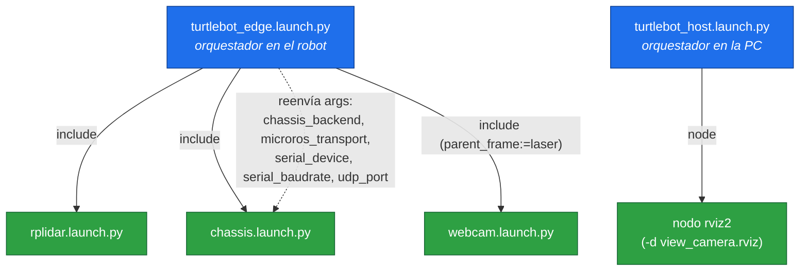
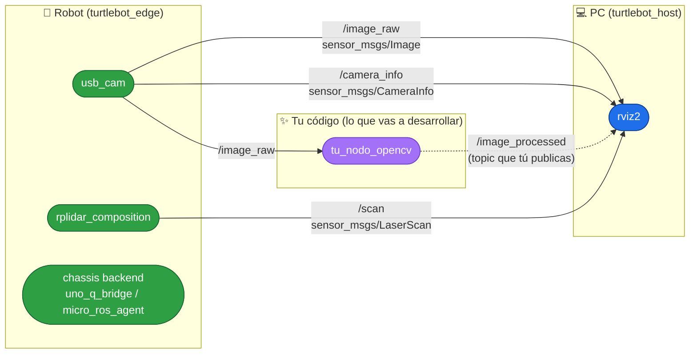
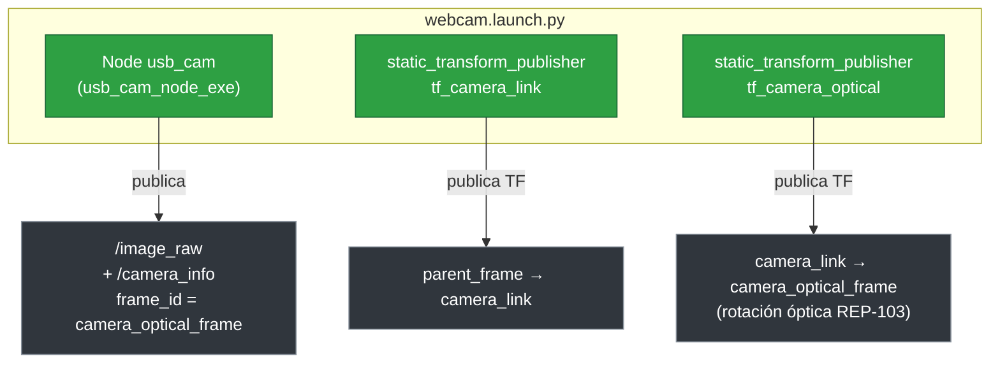
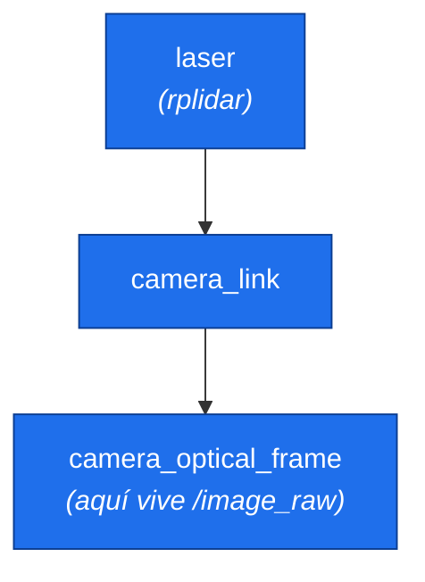
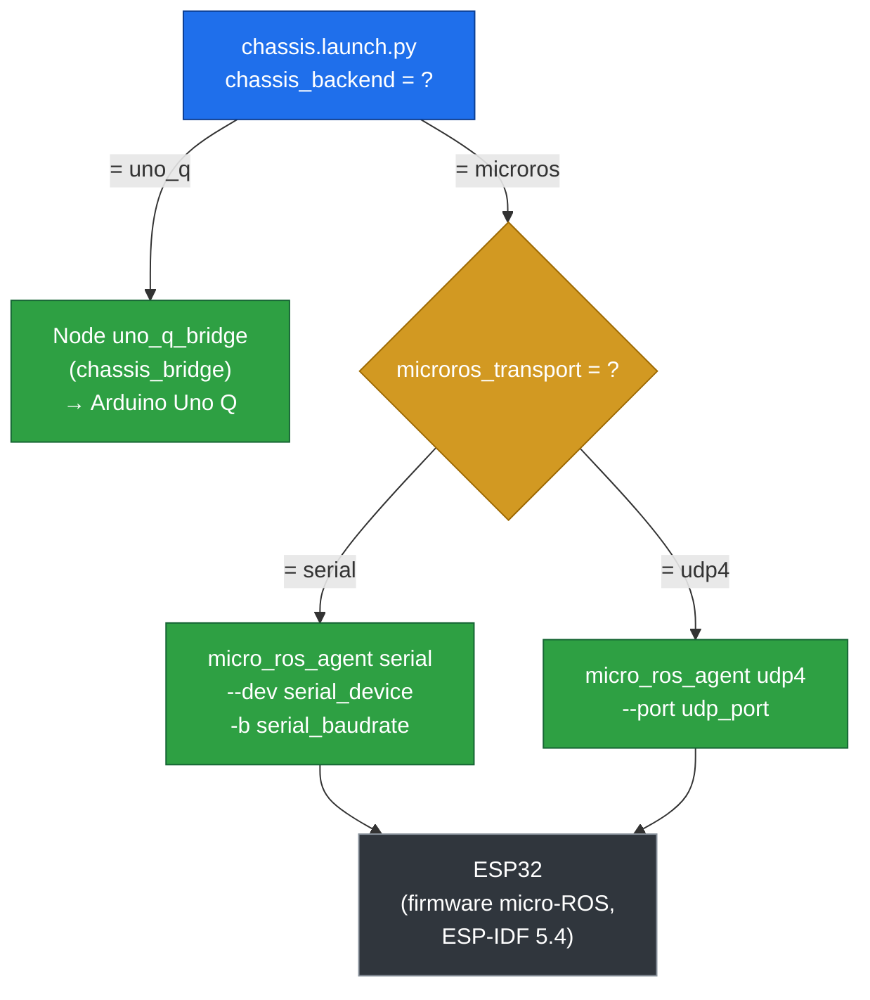
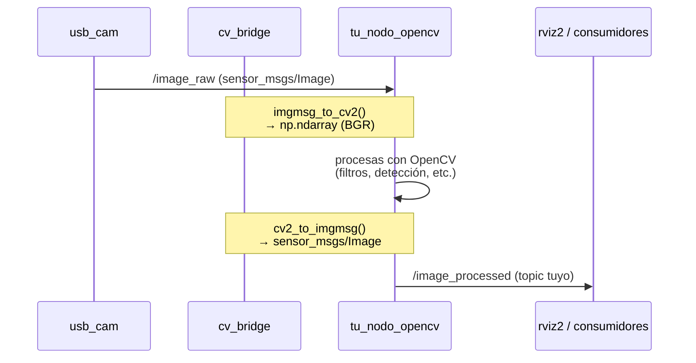

# Runbook · Arquitectura del paquete `turtlebot_core`

Este runbook explica cómo está estructurado hoy el paquete `turtlebot_core` y,
sobre todo, **cómo fluye la información por la red de ROS 2** (nodos, topics y
TF). El objetivo es que puedas ubicar dónde "engancha" tu propio nodo de OpenCV
para empezar a procesar la imagen de la webcam.

> Los diagramas están en [Mermaid](https://mermaid.js.org/). Se renderizan solos
> en GitHub y en VSCode (con la vista previa de Markdown).

---

## 1. Qué es cada archivo del paquete

```
turtlebot_core/
├── launch/
│   ├── turtlebot_edge.launch.py     ← ENTRADA en el robot: lidar + chassis + webcam
│   ├── turtlebot_host.launch.py     ← ENTRADA en la PC: RViz2 (visualización)
│   ├── rplidar.launch.py            ← driver del lidar          → /scan
│   ├── chassis.launch.py            ← backend del chassis (conmutable)
│   ├── webcam.launch.py             ← driver de la cámara + TF  → /image_raw
│   ├── view_rplidar.launch.py       ← RViz solo lidar
│   ├── remote_rplidar.launch.py     ← variantes para lanzar en remoto
│   └── remote_chassis.launch.py
├── rviz/
│   ├── view_camera.rviz             ← config de RViz con cámara + lidar + TF
│   └── view_rplidar.rviz
├── turtlebot_core/
│   ├── control_led.py               ← nodo: publica /set_led (manual)
│   └── toggle_led.py                ← nodo: publica /set_led (automático)
├── package.xml / setup.py           ← metadatos y build del paquete
└── README.md
```

Hay **dos puntos de entrada** según dónde ejecutes:

| Launch                     | ¿Dónde corre? | ¿Qué levanta? |
|----------------------------|---------------|---------------|
| `turtlebot_edge.launch.py` | En el robot   | Sensores y actuadores (lidar, chassis, cámara) |
| `turtlebot_host.launch.py` | En tu PC      | Herramientas de visualización (RViz2) |

Ambos hablan por la **misma red de ROS 2** (DDS), así que la PC "ve" los topics
que publica el robot sin configuración extra (misma `ROS_DOMAIN_ID`).

---

## 2. Jerarquía de los launch (quién incluye a quién)

`turtlebot_edge.launch.py` es un **orquestador**: no crea nodos directamente,
sino que incluye a los otros tres launch y les reenvía argumentos.



> En el host, el `chassis` está **comentado** a propósito: su backend depende de
> la plataforma física, por eso se lanza desde el edge.

---

## 3. La red de nodos y topics (lo importante para OpenCV)

Este es el grafo que verías con `rqt_graph` cuando corre el edge. Los óvalos son
**nodos**, las flechas etiquetadas son **topics**.



**Topics que te interesan para visión:**

| Topic          | Tipo de mensaje            | Lo publica    | Para qué |
|----------------|----------------------------|---------------|----------|
| `/image_raw`   | `sensor_msgs/Image`        | `usb_cam`     | La imagen cruda de la webcam (aquí te suscribes) |
| `/camera_info` | `sensor_msgs/CameraInfo`   | `usb_cam`     | Calibración/intrínsecos (para proyección 3D) |
| `/scan`        | `sensor_msgs/LaserScan`    | `rplidar`     | Barrido del lidar (si mezclas visión + lidar) |
| `/set_led`     | `std_msgs/Bool`            | nodos LED     | Ejemplo de actuación hacia el chassis |

---

## 4. Detalle: `webcam.launch.py`

Este launch levanta **3 procesos**: el driver de la cámara y dos publicadores de
transformada estática (TF). La imagen se publica con `frame_id =
camera_optical_frame` para que RViz2 la oriente bien.



**Argumentos configurables** (con `arg:=valor`):

| Argumento       | Default                | Descripción |
|-----------------|------------------------|-------------|
| `video_device`  | `/dev/video0`          | Dispositivo V4L2 (usa la ruta `by-id`) |
| `parent_frame`  | `base_link`            | Frame padre en el árbol TF (el edge lo fija en `laser`) |
| `camera_frame`  | `camera_link`          | Frame físico de la cámara |
| `optical_frame` | `camera_optical_frame` | Frame óptico con el que se publica la imagen |

### Árbol de TF resultante

En el edge, la cámara se ancla al frame del lidar (`laser`) para que todo el
árbol quede conectado:



> El default (`base_link`) aplica cuando lanzas la cámara sola con un
> `robot_state_publisher` que ya publica `base_link`. Sin lidar ni robot, usa
> `parent_frame:=laser` o el frame que exista.

---

## 5. Detalle: `chassis.launch.py` (backend conmutable)

El chassis puede hablar con **dos hardwares distintos**. El launch elige cuál
levantar según el argumento `chassis_backend`, usando condiciones (`IfCondition`)
— por eso solo arranca el nodo que corresponde.



**Argumentos:**

| Argumento            | Default        | Choices          | Aplica cuando |
|----------------------|----------------|------------------|---------------|
| `chassis_backend`    | `uno_q`        | `uno_q`, `microros` | siempre |
| `microros_transport` | `serial`       | `serial`, `udp4` | `chassis_backend=microros` |
| `serial_device`      | `/dev/ttyUSB0` | —                | transporte `serial` |
| `serial_baudrate`    | `115200`       | —                | transporte `serial` |
| `udp_port`           | `8888`         | —                | transporte `udp4` |

Ejemplos:

```bash
# Arduino Uno Q
ros2 launch turtlebot_core chassis.launch.py chassis_backend:=uno_q

# ESP32 por serial
ros2 launch turtlebot_core chassis.launch.py \
  chassis_backend:=microros microros_transport:=serial serial_device:=/dev/ttyUSB0

# ESP32 por WiFi (UDP)
ros2 launch turtlebot_core chassis.launch.py \
  chassis_backend:=microros microros_transport:=udp4 udp_port:=8888
```

---

## 6. Dónde entra TU nodo de OpenCV

Tu nodo es **un suscriptor más** de `/image_raw`. No tienes que tocar
`webcam.launch.py`: te conectas al topic que ya publica `usb_cam`.



Esqueleto mínimo de un nodo suscriptor (rclpy + cv_bridge):

```python
import rclpy
from rclpy.node import Node
from sensor_msgs.msg import Image
from cv_bridge import CvBridge
import cv2


class OpenCVNode(Node):
    def __init__(self):
        super().__init__('tu_nodo_opencv')
        self.bridge = CvBridge()
        # Te suscribes al topic que ya publica usb_cam:
        self.sub = self.create_subscription(
            Image, '/image_raw', self.on_image, 10)
        # Publicas tu resultado en un topic propio:
        self.pub = self.create_publisher(Image, '/image_processed', 10)

    def on_image(self, msg):
        frame = self.bridge.imgmsg_to_cv2(msg, desired_encoding='bgr8')

        # --- tu procesamiento OpenCV aquí ---
        gray = cv2.cvtColor(frame, cv2.COLOR_BGR2GRAY)
        out = cv2.cvtColor(gray, cv2.COLOR_GRAY2BGR)
        # -------------------------------------

        out_msg = self.bridge.cv2_to_imgmsg(out, encoding='bgr8')
        out_msg.header = msg.header  # conserva timestamp y frame_id
        self.pub.publish(out_msg)


def main():
    rclpy.init()
    rclpy.spin(OpenCVNode())
    rclpy.shutdown()
```

> Conserva `msg.header` en tu salida: así tu imagen procesada mantiene el
> `frame_id = camera_optical_frame` y RViz2 la puede ubicar en el árbol de TF
> igual que `/image_raw`.

---

## 7. Flujo de trabajo para empezar a desarrollar

1. **Levanta la cámara** (en el robot o localmente con la webcam):

   ```bash
   ros2 launch turtlebot_core webcam.launch.py \
     video_device:=/dev/v4l/by-id/<tu-camara>-video-index0
   ```

   (Identificar la cámara → [`runbook-webcam.md`](./runbook-webcam.md))

2. **Confirma que la imagen publica:**

   ```bash
   ros2 topic list | grep image        # /image_raw, /camera_info
   ros2 topic hz /image_raw            # ~30 Hz
   ros2 topic echo /image_raw --once   # inspecciona el header (frame_id)
   ```

3. **Explora el grafo en vivo** (muy útil para ver dónde encaja tu nodo):

   ```bash
   rqt_graph
   ```

4. **Escribe tu nodo** suscrito a `/image_raw`, procésalo con OpenCV y publica en
   un topic propio (sección 6).

5. **Visualiza el resultado** en RViz2 agregando un display *Image* apuntando a
   tu topic (`/image_processed`). Guía: `rviz/README.md` del paquete.

---

## Resumen mental

- `turtlebot_edge` = **datos** (sensores/actuadores en el robot).
- `turtlebot_host` = **visualización** (RViz2 en la PC).
- `webcam.launch.py` publica `/image_raw` (+ TF) → **tu punto de entrada para OpenCV**.
- `chassis.launch.py` decide el hardware (Uno Q vs ESP32) según argumentos.
- Tu nodo se **suscribe** a `/image_raw` y **publica** su propio topic; no
  modificas los launch existentes.
